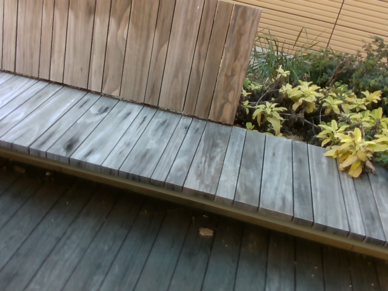
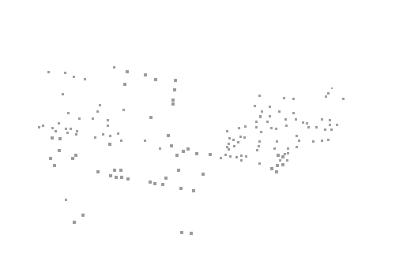
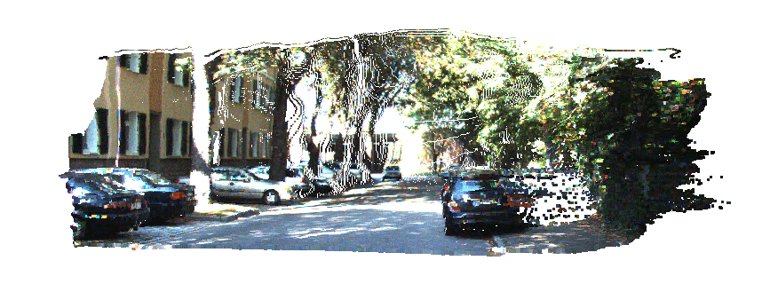

# Awesome Depth Completion

**Table of Contents**
- [About Sparse-to-Dense Depth Completion](#unsupervised-void-benchmark)
- [Current State of Depth Completion](#current-state-of-depth-completion)
    - [Unsupervised VOID Benchmark](#unsupervised-void-benchmark)
    - [Supervised VOID Benchmark](#supervised-void-benchmark)
    - [Unsupervised KITTI Benchmark](#unsupervised-kitti-benchmark)
    - [Supervised KITTI Benchmark](#supervised-kitti-benchmark)

## About Sparse-to-Dense Depth Completion 

In the sparse-to-dense depth completion problem, one wants to infer the dense depth map of a 3-D scene given an RGB image and its corresponding sparse reconstruction in the form of a sparse depth map obtained either from computational methods such as SfM (Strcuture-from-Motion) or active sensors such as lidar or structured light sensors.

**Example 1: VOID dataset (indoor)**
| *Input RGB image*  | *Sparse point cloud*| *Output point cloud from [KBNet](https://github.com/alexklwong/calibrated-backprojection-network)* |
| :----------------------------------------- |  :----------------------------------------- | :--------------------------------------------------------: |
|  |   |   |

**Example 2: KITTI dataset (outdoor)**
| *Input RGB image*    | *Output point cloud from [ScaffNet](https://github.com/alexklwong/learning-topology-synthetic-data)* |
| :------------------------------------------ | :--------------------------------------------------------: |
|  |  |

## Current State of Depth Completion Methods 

Here we compile both unsupervised/self-supervised (monocular and stereo) and supervised methods published in recent conferences and journals on the VOID (Wong et. al., 2020) and KITTI (Uhrig et. al., 2017) depth completion benchmarks. Our ranking considers all four metrics rather than just RMSE.

**Quick Links**
- [Unsupervised VOID Benchmark](#unsupervised-void-benchmark)
- [Supervised VOID Benchmark](#supervised-void-benchmark)
- [Unsupervised KITTI Benchmark](#unsupervised-kitti-benchmark)
- [Supervised KITTI Benchmark](#supervised-kitti-benchmark)

### Unsupervised VOID Depth Completion Benchmark 
| Paper | Publication | Code | MAE | RMSE | iMAE | iRMSE |
| :---- | :---------: | :--: | :-: | :--: | :--: | ----: |
| Unsupervised Depth Completion with Calibrated Backprojection Layers| [ICCV 2021](https://arxiv.org/pdf/2108.10531.pdf) | [PyTorch](https://github.com/alexklwong/calibrated-backprojection-network) | **39.80**  | **95.86**   | **21.16** | **49.72**  |
| Learning Topology from Synthetic Data for Unsupervised Depth Completion | [RA-L & ICRA 2021](https://arxiv.org/pdf/2106.02994.pdf) | [Tensorflow](https://github.com/alexklwong/learning-topology-synthetic-data) | 60.68 | 122.01 | 35.24 | 67.34 |
| Unsupervised Depth Completion from Visual Inertial Odometry | [RA-L & ICRA 2020](https://arxiv.org/pdf/1905.08616.pdf) | [Tensorflow](https://github.com/alexklwong/unsupervised-depth-completion-visual-inertial-odometry) | 85.05 | 169.79 | 48.92 | 104.02 |
| Dense depth posterior (ddp) from single image and sparse range | [CVPR 2019](http://openaccess.thecvf.com/content_CVPR_2019/papers/Yang_Dense_Depth_Posterior_DDP_From_Single_Image_and_Sparse_Range_CVPR_2019_paper.pdf) | [Tensorflow](https://github.com/YanchaoYang/Dense-Depth-Posterior) | 151.86 | 222.36 | 74.59 | 112.36 |
| Self-supervised Sparse-to-Dense: Self- supervised Depth Completion from LiDAR and Monocular Camera | [ICRA 2019](https://arxiv.org/pdf/1807.00275) | [PyTorch](https://github.com/fangchangma/self-supervised-depth-completion) | 178.85 | 243.84 | 80.12 | 107.69 |

### Supervised VOID Depth Completion Benchmark 
| Paper | Publication | Code | MAE | RMSE | iMAE | iRMSE |
| :---- | :---------: | :--: | :-: | :--: | :--: | ----: |
| Scanline Resolution-Invariant Depth Completion Using a Single Image and Sparse LiDAR Point Cloud | [RA-L & IROS 2021](https://ieeexplore.ieee.org/document/9483665) | N/A | **59.40** | **181.42** | **19.37** | **46.56** |

### Unsupervised KITTI Depth Completion Benchmark 
| Paper | Publication | Code | MAE | RMSE | iMAE | iRMSE |
| :---- | :---------: | :--: | :-: | :--: | :--: | ----: |
| Unsupervised Depth Completion with Calibrated Backprojection Layers| [ICCV 2021](https://arxiv.org/pdf/2108.10531.pdf) | [PyTorch](https://github.com/alexklwong/calibrated-backprojection-network) | **256.76** | **1069.47** | **1.02**  | **2.95**  |
| Learning Topology from Synthetic Data for Unsupervised Depth Completion | [RA-L & ICRA 2021](https://arxiv.org/pdf/2106.02994.pdf) | [Tensorflow](https://github.com/alexklwong/learning-topology-synthetic-data) | 280.76 | 1121.93 | 1.15 | 3.30 |
| Project to Adapt: Domain Adaptation for Depth Completion from Noisy and Sparse Sensor Data | [ACCV 2020](https://openaccess.thecvf.com/content/ACCV2020/papers/Lopez-Rodriguez_Project_to_Adapt_Domain_Adaptation_for_Depth_Completion_from_Noisy_ACCV_2020_paper.pdf) | [PyTorch](https://github.com/alopezgit/project-adapt) | 280.42 | 1095.26 | 1.19 | 3.53 |
| Unsupervised Depth Completion from Visual Inertial Odometry | [RA-L & ICRA 2020](https://arxiv.org/pdf/1905.08616.pdf) | [Tensorflow](https://github.com/alexklwong/unsupervised-depth-completion-visual-inertial-odometry) | 299.41 | 1169.97 | 1.20 | 3.56 |
| A Surface Geometry Model for LiDAR Depth Completion | [RA-L & ICRA 2021](https://arxiv.org/pdf/2104.08466.pdf) | [Tensorflow](https://github.com/placeforyiming/RAL_Non-Learning_DepthCompletion) | 298.3 | 1239.84 | 1.21 | 3.76 |
| Dense depth posterior (ddp) from single image and sparse range | [CVPR 2019](http://openaccess.thecvf.com/content_CVPR_2019/papers/Yang_Dense_Depth_Posterior_DDP_From_Single_Image_and_Sparse_Range_CVPR_2019_paper.pdf) | [Tensorflow](https://github.com/YanchaoYang/Dense-Depth-Posterior) | 343.46 | 1263.19 | 1.32 | 3.58 |
| DFuseNet: Deep Fusion of RGB and Sparse Depth Information for Image Guided Dense Depth Completion | [ITSC 2019](https://arxiv.org/pdf/1902.00761) | [PyTorch](https://github.com/ShreyasSkandanS/DFuseNet) | 429.93 | 1206.66 | 1.79 | 3.62 |
| In Defense of Classical Image Processing: Fast Depth Completion on the CPU | [CRV 2018](https://arxiv.org/pdf/1802.00036) | [Python](https://github.com/kujason/ip_basic) | 302.60 | 1288.46 | 1.29 | 3.78 |
| Self-supervised Sparse-to-Dense: Self- supervised Depth Completion from LiDAR and Monocular Camera | [ICRA 2019](https://arxiv.org/pdf/1807.00275) | [PyTorch](https://github.com/fangchangma/self-supervised-depth-completion) | 350.32 | 1299.85 | 1.57 | 4.07 |
| Semantically Guided Depth Upsampling | [GCPR 2016](https://arxiv.org/pdf/1608.00753) | N/A | 605.47 | 2312.57 | 2.05 | 7.38 |

### Supervised KITTI Depth Completion Benchmark 
| Paper | Publication | Code | MAE | RMSE | iMAE | iRMSE |
| :---- | :---------: | :--: | :-: | :--: | :--: | ----: |
| Non-Local Spatial Propagation Network for Depth Completion | [ECCV 2020](https://arxiv.org/pdf/2007.10042.pdf) | [PyTorch](https://github.com/zzangjinsun/NLSPN_ECCV20) | **199.5** | 741.68 | **0.84** | **1.99** |
| CSPN++: Learning Context and Resource Aware Convolutional Spatial Propagation Networks for Depth Completion | [AAAI 2020](https://arxiv.org/pdf/1911.05377) | N/A | 209.28 | 743.69 | 0.90 | 2.07 |
| Dense depth posterior (ddp) from single image and sparse range | [CVPR 2019](http://openaccess.thecvf.com/content_CVPR_2019/papers/Yang_Dense_Depth_Posterior_DDP_From_Single_Image_and_Sparse_Range_CVPR_2019_paper.pdf) | [Tensorflow](https://github.com/YanchaoYang/Dense-Depth-Posterior) | 203.96 | 832.94 | 0.85 | 2.10 |
| Adaptive context-aware multi-modal network for depth completion | [TIP 2021](https://arxiv.org/abs/2008.10833) | [PyTorch](https://github.com/sshan-zhao/ACMNet) | 206.80 | 732.99 | 0.90 | 2.08 |
| PENet: Towards Precise and Efficient Image Guided Depth Completion | [ICRA 2021](https://arxiv.org/abs/2103.00783) | [PyTorch](https://github.com/JUGGHM/PENet_ICRA2021) | 210.55 | **730.08** | 0.94 | 2.17 |
| FCFR-Net: Feature Fusion based Coarse- to-Fine Residual Learning for Depth Completion | [AAAI 2021](https://arxiv.org/pdf/2012.08270.pdf) | N/A | 217.15 | 735.81 | 0.98 | 2.20 |
| Learning Guided Convolutional Network for Depth Completion | [TIP 2020](https://ieeexplore.ieee.org/document/9286883) | [PyTorch](https://github.com/kakaxi314/GuideNet) | 218.83 | 736.24 | 0.99 | 2.25 |
| DenseLiDAR: A Real-Time Pseudo Dense Depth Guided Depth Completion Network | [ICRA 2021](https://ieeexplore.ieee.org/document/9357967) | N/A | 214.13 | 755.41 | 0.96 | 2.25 |
| A Multi-Scale Guided Cascade Hourglass Network for Depth Completion | [WACV 2020](http://openaccess.thecvf.com/content_WACV_2020/papers/Li_A_Multi-Scale_Guided_Cascade_Hourglass_Network_for_Depth_Completion_WACV_2020_paper.pdf) | [PyTorch](https://github.com/anglixjtu/msg_chn_wacv20) | 220.41 | 762.19 | 0.98 | 2.30 |
| Sparse and noisy LiDAR completion with RGB guidance and uncertainty | [MVA 2019](https://arxiv.org/pdf/1902.05356) | [PyTorch](https://github.com/wvangansbeke/Sparse-Depth-Completion) | 215.02 | 772.87 | 0.93 | 2.19 |
| A Multi-Scale Guided Cascade Hourglass Network for Depth Completion | [WACV 2020](http://openaccess.thecvf.com/content_WACV_2020/papers/Li_A_Multi-Scale_Guided_Cascade_Hourglass_Network_for_Depth_Completion_WACV_2020_paper.pdf) | N/A | 220.41 | 762.19 | 0.98 | 2.30 |
| Learning Joint 2D-3D Representations for Depth Completion | [ICCV 2019](http://openaccess.thecvf.com/content_ICCV_2019/papers/Chen_Learning_Joint_2D-3D_Representations_for_Depth_Completion_ICCV_2019_paper.pdf) | N/A | 221.19 | 752.88 | 1.14 | 2.34 |
| DeepLiDAR: Deep Surface Normal Guided Depth Prediction for Outdoor Scene From Sparse LiDAR Data and Single Color Image | [CVPR 2019](http://openaccess.thecvf.com/content_CVPR_2019/papers/Qiu_DeepLiDAR_Deep_Surface_Normal_Guided_Depth_Prediction_for_Outdoor_Scene_CVPR_2019_paper.pdf) | [PyTorch](https://github.com/JiaxiongQ/DeepLiDAR) | 226.50 | 758.38 | 1.15 | 2.56 |
| Depth Completion from Sparse LiDAR Data with Depth-Normal Constraints | [ICCV 2019](http://openaccess.thecvf.com/content_ICCV_2019/papers/Xu_Depth_Completion_From_Sparse_LiDAR_Data_With_Depth-Normal_Constraints_ICCV_2019_paper.pdf) | N/A | 235.17 | 777.05 | 1.13 | 2.42 |
| Scanline Resolution-Invariant Depth Completion Using a Single Image and Sparse LiDAR Point Cloud | [RA-L & IROS 2021](https://ieeexplore.ieee.org/document/9483665) | N/A | 233.34 | 809.09 | 1.06 | 2.57 |
| Confidence propagation through cnns for guided sparse depth regression | [PAMI 2019](https://arxiv.org/pdf/1811.01791) | [PyTorch](https://github.com/abdo-eldesokey/nconv) | 233.26 | 829.98 | 1.03 | 2.60 |
| Self-supervised Sparse-to-Dense: Self- supervised Depth Completion from LiDAR and Monocular Camera | [ICRA 2019](https://arxiv.org/pdf/1807.00275) | [PyTorch](https://github.com/fangchangma/self-supervised-depth-completion) | 249.95 | 814.73 | 1.21 | 2.80 |
| Uncertainty-Aware CNNs for Depth Completion: Uncertainty from Beginning to End | [CVPR 2020](https://openaccess.thecvf.com/content_CVPR_2020/papers/Eldesokey_Uncertainty-Aware_CNNs_for_Depth_Completion_Uncertainty_from_Beginning_to_End_CVPR_2020_paper.pdf) | [PyTorch](https://github.com/abdo-eldesokey/pncnn) | 251.77 | 960.05 | 1.05 | 3.37 |
| Sparse and Dense Data with CNNs: Depth Completion and Semantic Segmentation | [3DV 2019](https://arxiv.org/pdf/1808.00769) | N/A | 234.81 | 917.64 | 0.95 | 2.17 |
| Depth coefficients for depth completion | [CVPR 2019](https://arxiv.org/pdf/1903.05421) | N/A | 252.21 | 988.38 |	1.13 | 2.87 |
|  Depth estimation via affinity learned with convolutional spatial propagation network | [ECCV 2018](http://openaccess.thecvf.com/content_ECCV_2018/papers/Xinjing_Cheng_Depth_Estimation_via_ECCV_2018_paper.pdf) | N/A | 279.46 | 1019.64 | 1.15 | 2.93 |
| Learning morphological operators for depth completion | [ACIVS 2019](https://biblio.ugent.be/publication/8569539/file/8569540.pdf) | N/A | 310.49 | 1045.45 |	1.57 | 3.84 |
| Sparsity Invariant CNNs | [3DV 2017](https://arxiv.org/pdf/1708.06500) | [Tensorflow](https://github.com/WHAAAT/sparse_convolution) | 416.14 | 1419.75	| 1.29 | 3.25
| Deep Convolutional Compressed Sensing for LiDAR Depth Completion | [ACCV 2018](https://arxiv.org/pdf/1803.08949) | [Tensorflow](https://github.com/nchodosh/Super-LiDAR) | 439.48 | 1325.37 |	3.19 | 59.39 |
