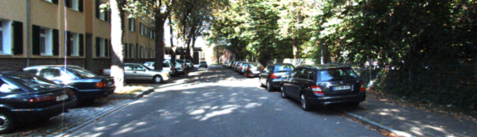

# Awesome Depth Completion

**Table of Contents**
- [About Sparse-to-Dense Depth Completion](#unsupervised-void-benchmark)
- [Current State of Depth Completion](#current-state-of-depth-completion)
    - [Unsupervised VOID Benchmark](#unsupervised-void-benchmark)
    - [Supervised VOID Benchmark](#supervised-void-benchmark)
    - [Unsupervised KITTI Benchmark](#unsupervised-kitti-benchmark)
    - [Supervised KITTI Benchmark](#supervised-kitti-benchmark)

## About Sparse-to-Dense Depth Completion 

In the sparse-to-dense depth completion problem, one wants to infer the dense depth map of a 3-D scene given an RGB image and its corresponding sparse reconstruction in the form of a sparse depth map obtained either from computational methods such as SfM (Strcuture-from-Motion) or active sensors such as lidar or structured light sensors.

**Example 1: [VOID dataset](https://github.com/alexklwong/void-dataset) (indoor VIO)**
| *Input RGB image*  | *Sparse point cloud*| *Output point cloud from [KBNet](https://github.com/alexklwong/calibrated-backprojection-network)* |
| :----------------------------------------- |  :----------------------------------------- | :--------------------------------------------------------: |
|  |   |   |

**Example 2: [KITTI dataset](http://www.cvlibs.net/datasets/kitti/) (outdoor lidar)**
| *Input RGB image*    | *Output point cloud from [ScaffNet](https://github.com/alexklwong/learning-topology-synthetic-data)* |
| :------------------------------------------ | :--------------------------------------------------------: |
|  |  |

## Current State of Depth Completion Methods 

Here we compile both unsupervised/self-supervised (monocular and stereo) and supervised methods published in recent conferences and journals on the VOID (Wong et. al., 2020) and KITTI (Uhrig et. al., 2017) depth completion benchmarks. Our ranking considers all four metrics rather than just RMSE.

**Quick Links**
- [Unsupervised VOID Benchmark](#unsupervised-void-benchmark)
- [Supervised VOID Benchmark](#supervised-void-benchmark)
- [Unsupervised KITTI Benchmark](#unsupervised-kitti-benchmark)
- [Supervised KITTI Benchmark](#supervised-kitti-benchmark)

### Unsupervised VOID Depth Completion Benchmark 
| Paper | Publication | Code | MAE | RMSE | iMAE | iRMSE |
| :---- | :---------: | :--: | :-: | :--: | :--: | ----: |
| AugUndo: Scaling Up Augmentations for Monocular Depth Completion and Estimation | [ECCV 2024](https://arxiv.org/pdf/2310.09739) | [PyTorch](https://github.com/alexklwong/augundo) | **33.32** | **85.67** | **16.61** | **41.24** |
| Monitored Distillation for Positive Congruent Depth Completion| [ECCV 2022](https://arxiv.org/pdf/2203.16034.pdf) | [PyTorch](https://github.com/alexklwong/mondi-python) | 36.42 | 87.78 | 19.18 | 43.83 |
| DesNet: Decomposed Scale-Consistent Network for Unsupervised Depth Completion | [AAAI 2023](https://arxiv.org/pdf/2211.10994) | N/A | 37.41 | 93.31 | 19.17 | 45.57 |
| Unsupervised Depth Completion with Calibrated Backprojection Layers| [ICCV 2021](https://arxiv.org/pdf/2108.10531.pdf) | [PyTorch](https://github.com/alexklwong/calibrated-backprojection-network) | 39.80  | 95.86   | 21.16 | 49.72 |
| Learning Topology from Synthetic Data for Unsupervised Depth Completion | [RA-L & ICRA 2021](https://arxiv.org/pdf/2106.02994.pdf) | [TensorFlow/PyTorch](https://github.com/alexklwong/learning-topology-synthetic-data) | 60.68 | 122.01 | 35.24 | 67.34 |
| Unsupervised Depth Completion from Visual Inertial Odometry | [RA-L & ICRA 2020](https://arxiv.org/pdf/1905.08616.pdf) | [TensorFlow/PyTorch](https://github.com/alexklwong/unsupervised-depth-completion-visual-inertial-odometry) | 85.05 | 169.79 | 48.92 | 104.02 |
| Struct-MDC: Mesh-Refined Unsupervised Depth Completion Leveraging Structural Regularities from Visual SLAM | [RA-L & IROS 2022](https://arxiv.org/pdf/2204.13877) | [PyTorch](https://github.com/url-kaist/Struct-MDC) | 111.33 | 216.50 | -- | -- |
| Dense depth posterior (ddp) from single image and sparse range | [CVPR 2019](http://openaccess.thecvf.com/content_CVPR_2019/papers/Yang_Dense_Depth_Posterior_DDP_From_Single_Image_and_Sparse_Range_CVPR_2019_paper.pdf) | [TensorFlow](https://github.com/YanchaoYang/Dense-Depth-Posterior) | 151.86 | 222.36 | 74.59 | 112.36 |
| Self-supervised Sparse-to-Dense: Self- supervised Depth Completion from LiDAR and Monocular Camera | [ICRA 2019](https://arxiv.org/pdf/1807.00275) | [PyTorch](https://github.com/fangchangma/self-supervised-depth-completion) | 178.85 | 243.84 | 80.12 | 107.69 |

### Supervised VOID Depth Completion Benchmark 
| Paper | Publication | Code | MAE | RMSE | iMAE | iRMSE |
| :---- | :---------: | :--: | :-: | :--: | :--: | ----: |
| CostDCNet: Cost Volume based Depth Completion for a Single RGB-D Image | [ECCV 2022](https://www.ecva.net/papers/eccv_2022/papers_ECCV/papers/136620248.pdf) | [PyTorch](https://github.com/kamse/CostDCNet) | **25.84** | **76.28** | **12.19** | **32.13** |
| Non-Local Spatial Propagation Network for Depth Completion | [ECCV 2020](https://arxiv.org/pdf/2007.10042.pdf) | [PyTorch](https://github.com/zzangjinsun/NLSPN_ECCV20) | 26.74 | 79.12 | 12.70 | 33.88 |
| Monitored Distillation for Positive Congruent Depth Completion | [ECCV 2022](https://arxiv.org/pdf/2203.16034.pdf) | [PyTorch](https://github.com/alexklwong/mondi-python) |  29.67 | 79.78 | 14.84 | 37.88 |
| PENet: Towards Precise and Efficient Image Guided Depth Completion (PENet) | [ICRA 2021](https://arxiv.org/abs/2103.00783) | [PyTorch](https://github.com/JUGGHM/PENet_ICRA2021) | 34.61 | 82.01 | 18.89 | 40.36 |
| A Multi-Scale Guided Cascade Hourglass Network for Depth Completion | [WACV 2020](http://openaccess.thecvf.com/content_WACV_2020/papers/Li_A_Multi-Scale_Guided_Cascade_Hourglass_Network_for_Depth_Completion_WACV_2020_paper.pdf) | [PyTorch](https://github.com/anglixjtu/msg_chn_wacv20) | 43.57 | 109.94 | 23.44 | 52.09 |
| PENet: Towards Precise and Efficient Image Guided Depth Completion (ENet) | [ICRA 2021](https://arxiv.org/abs/2103.00783) | [PyTorch](https://github.com/JUGGHM/PENet_ICRA2021) | 46.90 | 94.35 | 26.78 | 52.58 |
| Scanline Resolution-Invariant Depth Completion Using a Single Image and Sparse LiDAR Point Cloud | [RA-L & IROS 2021](https://ieeexplore.ieee.org/document/9483665) | N/A | 59.40 | 181.42 | 19.37 | 46.56 |

### Unsupervised KITTI Depth Completion Benchmark 
| Paper | Publication | Code | MAE | RMSE | iMAE | iRMSE |
| :---- | :---------: | :--: | :-: | :--: | :--: | ----: |
| Monitored Distillation for Positive Congruent Depth Completion| [ECCV 2022](https://arxiv.org/pdf/2203.16034.pdf) | [PyTorch](https://github.com/alexklwong/mondi-python) | **218.60** | **785.06**   | **0.92** | **2.11**  |
| Unsupervised Depth Completion with Calibrated Backprojection Layers| [ICCV 2021](https://arxiv.org/pdf/2108.10531.pdf) | [PyTorch](https://github.com/alexklwong/calibrated-backprojection-network) | 256.76 | 1069.47 | 1.02 | 2.95 |
| Project to Adapt: Domain Adaptation for Depth Completion from Noisy and Sparse Sensor Data | [ACCV 2020](https://openaccess.thecvf.com/content/ACCV2020/papers/Lopez-Rodriguez_Project_to_Adapt_Domain_Adaptation_for_Depth_Completion_from_Noisy_ACCV_2020_paper.pdf) | [PyTorch](https://github.com/alopezgit/project-adapt) | 280.42 | 1095.26 | 1.19 | 3.53 |
| Learning Topology from Synthetic Data for Unsupervised Depth Completion | [RA-L & ICRA 2021](https://arxiv.org/pdf/2106.02994.pdf) | [TensorFlow](https://github.com/alexklwong/learning-topology-synthetic-data) | 280.76 | 1121.93 | 1.15 | 3.30 |
| Unsupervised Depth Completion from Visual Inertial Odometry | [RA-L & ICRA 2020](https://arxiv.org/pdf/1905.08616.pdf) | [TensorFlow](https://github.com/alexklwong/unsupervised-depth-completion-visual-inertial-odometry) | 299.41 | 1169.97 | 1.20 | 3.56 |
| A Surface Geometry Model for LiDAR Depth Completion | [RA-L & ICRA 2021](https://arxiv.org/pdf/2104.08466.pdf) | [TensorFlow](https://github.com/placeforyiming/RAL_Non-Learning_DepthCompletion) | 298.30 | 1239.84 | 1.21 | 3.76 |
| In Defense of Classical Image Processing: Fast Depth Completion on the CPU | [CRV 2018](https://arxiv.org/pdf/1802.00036) | [Python](https://github.com/kujason/ip_basic) | 302.60 | 1288.46 | 1.29 | 3.78 |
| Dense depth posterior (ddp) from single image and sparse range | [CVPR 2019](http://openaccess.thecvf.com/content_CVPR_2019/papers/Yang_Dense_Depth_Posterior_DDP_From_Single_Image_and_Sparse_Range_CVPR_2019_paper.pdf) | [TensorFlow](https://github.com/YanchaoYang/Dense-Depth-Posterior) | 343.46 | 1263.19 | 1.32 | 3.58 |
| Self-supervised Sparse-to-Dense: Self- supervised Depth Completion from LiDAR and Monocular Camera | [ICRA 2019](https://arxiv.org/pdf/1807.00275) | [PyTorch](https://github.com/fangchangma/self-supervised-depth-completion) | 350.32 | 1299.85 | 1.57 | 4.07 |
| DFuseNet: Deep Fusion of RGB and Sparse Depth Information for Image Guided Dense Depth Completion | [ITSC 2019](https://arxiv.org/pdf/1902.00761) | [PyTorch](https://github.com/ShreyasSkandanS/DFuseNet) | 429.93 | 1206.66 | 1.79 | 3.62 |
| Semantically Guided Depth Upsampling | [GCPR 2016](https://arxiv.org/pdf/1608.00753) | N/A | 605.47 | 2312.57 | 2.05 | 7.38 |

### Supervised KITTI Depth Completion Benchmark 
| Paper | Publication | Code | MAE | RMSE | iMAE | iRMSE |
| :---- | :---------: | :--: | :-: | :--: | :--: | ----: |
| CompletionFormer: Depth Completion with Convolutions and Vision Transformers (L1) | [CVPR 2023](https://arxiv.org/pdf/2304.13030.pdf) | [PyTorch](https://github.com/youmi-zym/CompletionFormer) | **183.88** | 764.87 | **0.80** | 1.89 |
| Improving Depth Completion via Depth Feature Upsampling | [CVPR 2024](https://openaccess.thecvf.com/content/CVPR2024/papers/Wang_Improving_Depth_Completion_via_Depth_Feature_Upsampling_CVPR_2024_paper.pdf) | [PyTorch](https://github.com/YufeiWang777/DFU) | 187.95 | 686.46 | 0.81 | 1.83 |
| Tri-Perspective View Decomposition for Geometry-Aware Depth Completion | [CVPR 2024](https://arxiv.org/pdf/2403.15008) | [PyTorch](https://yanzq95.github.io/projectpage/TOFDC/index.html) | 188.60 | 693.97 | 0.81 | **1.82** |
| BEVDC: Bird's-Eye View Assisted Training for Depth Completion | [CVPR 2023](https://openaccess.thecvf.com/content/CVPR2023/papers/Zhou_BEVDC_Birds-Eye_View_Assisted_Training_for_Depth_Completion_CVPR_2023_paper.pdf) | N/A | 189.44 | 697.44 | 0.82 | 1.83 |
| LRRU: Long-short Range Recurrent Updating Networks for Depth Completion (L1+L2) | [ICCV 2023](https://arxiv.org/pdf/2310.08956) | [PyTorch](https://github.com/YufeiWang777/LRRU) | 189.96 | 696.51 | 0.81 | 1.87 |
| Dynamic Spatial Propagation Network for Depth Completion | [AAAI 2022](https://arxiv.org/pdf/2202.09769.pdf) | [PyTorch](https://github.com/Kyakaka/DySPN) | 192.71 | 709.12 | 0.82 | 1.88 |
| OGNI-DC: Robust Depth Completion with Optimization-Guided Neural Iterations | [ECCV 2024](https://arxiv.org/pdf/2406.11711) | [PyTorch](https://github.com/princeton-vl/OGNI-DC) | 193.20 | 708.38 | 0.83 | 1.86 |
| Robust Depth Completion with Uncertainty-Driven Loss Functions | [AAAI 2022](https://arxiv.org/pdf/2112.07895) | N/A | 190.88 | 795.61 | 0.83 | 1.98 |
| Bilateral Propagation Network for Depth Completion | [CVPR 2024](https://arxiv.org/pdf/2403.11270) | [PyTorch](https://github.com/kakaxi314/BP-Net) | 194.69 | **684.90** | 0.84 | **1.82** |
| LRRU: Long-short Range Recurrent Updating Networks for Depth Completion (L2) | [ICCV 2023](https://arxiv.org/pdf/2310.08956) | [PyTorch](https://github.com/YufeiWang777/LRRU) | 198.31 | 695.67 | 0.86 | 2.18 |
| Non-Local Spatial Propagation Network for Depth Completion | [ECCV 2020](https://arxiv.org/pdf/2007.10042.pdf) | [PyTorch](https://github.com/zzangjinsun/NLSPN_ECCV20) | 199.59 | 741.68 | 0.84 | 1.99 |
| RigNet: Repetitive Image Guided Network for Depth Completion | [ECCV 2022](https://arxiv.org/pdf/2107.13802.pdf) | N/A | 203.25 | 712.66 | 0.90 | 2.08 |
| CompletionFormer: Depth Completion with Convolutions and Vision Transformers (L1+L2) | [CVPR 2023](https://arxiv.org/pdf/2304.13030.pdf) | [PyTorch](https://github.com/youmi-zym/CompletionFormer) | 203.45 | 708.87 | 0.88 | 2.01 |
| Dense depth posterior (ddp) from single image and sparse range | [CVPR 2019](http://openaccess.thecvf.com/content_CVPR_2019/papers/Yang_Dense_Depth_Posterior_DDP_From_Single_Image_and_Sparse_Range_CVPR_2019_paper.pdf) | [TensorFlow](https://github.com/YanchaoYang/Dense-Depth-Posterior) | 203.96 | 832.94 | 0.85 | 2.10 |
| SemAttNet: Towards Attention-based Semantic Aware Guided Depth Completion | [IEEE Access 2022](https://arxiv.org/pdf/2204.13635.pdf) | [PyTorch](https://github.com/danishnazir/SemAttNet) | 205.49  | 709.41 | 0.90 | 2.03 |
| Adaptive context-aware multi-modal network for depth completion | [TIP 2021](https://arxiv.org/abs/2008.10833) | [PyTorch](https://github.com/sshan-zhao/ACMNet) | 206.80 | 732.99 | 0.90 | 2.08 |
| MFF-Net: Towards Efficient Monocular Depth Completion with Multi-modal Feature Fusion | [RAL 2023](https://ieeexplore.ieee.org/iel7/7083369/7339444/10008014.pdf) | N/A | 208.11 | 719.85 | 0.94 | 2.21 |
| CSPN++: Learning Context and Resource Aware Convolutional Spatial Propagation Networks for Depth Completion | [AAAI 2020](https://arxiv.org/pdf/1911.05377) | N/A | 209.28 | 743.69 | 0.90 | 2.07 |
| PENet: Towards Precise and Efficient Image Guided Depth Completion | [ICRA 2021](https://arxiv.org/abs/2103.00783) | [PyTorch](https://github.com/JUGGHM/PENet_ICRA2021) | 210.55 | 730.08 | 0.94 | 2.17 |
| DenseLiDAR: A Real-Time Pseudo Dense Depth Guided Depth Completion Network | [ICRA 2021](https://ieeexplore.ieee.org/document/9357967) | N/A | 214.13 | 755.41 | 0.96 | 2.25 |
| MDANet: Multi-Modal Deep Aggregation Network for Depth Completion | [ICRA 2021](https://ieeexplore.ieee.org/stamp/stamp.jsp?arnumber=9561490) | [PyTorch](https://github.com/USTC-Keyanjie/MDANet_ICRA2021) | 214.99 | 738.23 | 0.99 | 2.12 |
| Sparse and noisy LiDAR completion with RGB guidance and uncertainty | [MVA 2019](https://arxiv.org/pdf/1902.05356) | [PyTorch](https://github.com/wvangansbeke/Sparse-Depth-Completion) | 215.02 | 772.87 | 0.93 | 2.19 |
| A Cascade Dense Connection Fusion Network for Depth Completion | [BMVC 2022](https://bmvc2022.mpi-inf.mpg.de/0843.pdf) | N/A | 216.05 | 738.26 | 0.99 | 2.18 |
| FCFR-Net: Feature Fusion based Coarse- to-Fine Residual Learning for Depth Completion | [AAAI 2021](https://arxiv.org/pdf/2012.08270.pdf) | N/A | 217.15 | 735.81 | 0.98 | 2.20 |
| Monitored Distillation for Positive Congruent Depth Completion | [ECCV 2022](https://arxiv.org/pdf/2203.16034.pdf) | [PyTorch](https://github.com/alexklwong/mondi-python) |  218.60 | 785.06 | 0.92 | 2.11  |
| Learning Guided Convolutional Network for Depth Completion | [TIP 2020](https://ieeexplore.ieee.org/document/9286883) | [PyTorch](https://github.com/kakaxi314/GuideNet) | 218.83 | 736.24 | 0.99 | 2.25 |
| A Multi-Scale Guided Cascade Hourglass Network for Depth Completion | [WACV 2020](http://openaccess.thecvf.com/content_WACV_2020/papers/Li_A_Multi-Scale_Guided_Cascade_Hourglass_Network_for_Depth_Completion_WACV_2020_paper.pdf) | [PyTorch](https://github.com/anglixjtu/msg_chn_wacv20) | 220.41 | 762.19 | 0.98 | 2.30 |
| Learning Joint 2D-3D Representations for Depth Completion | [ICCV 2019](http://openaccess.thecvf.com/content_ICCV_2019/papers/Chen_Learning_Joint_2D-3D_Representations_for_Depth_Completion_ICCV_2019_paper.pdf) | N/A | 221.19 | 752.88 | 1.14 | 2.34 |
| DeepLiDAR: Deep Surface Normal Guided Depth Prediction for Outdoor Scene From Sparse LiDAR Data and Single Color Image | [CVPR 2019](http://openaccess.thecvf.com/content_CVPR_2019/papers/Qiu_DeepLiDAR_Deep_Surface_Normal_Guided_Depth_Prediction_for_Outdoor_Scene_CVPR_2019_paper.pdf) | [PyTorch](https://github.com/JiaxiongQ/DeepLiDAR) | 226.50 | 758.38 | 1.15 | 2.56 |
| Confidence propagation through cnns for guided sparse depth regression | [PAMI 2019](https://arxiv.org/pdf/1811.01791) | [PyTorch](https://github.com/abdo-eldesokey/nconv) | 233.26 | 829.98 | 1.03 | 2.60 |
| Scanline Resolution-Invariant Depth Completion Using a Single Image and Sparse LiDAR Point Cloud | [RA-L & IROS 2021](https://ieeexplore.ieee.org/document/9483665) | N/A | 233.34 | 809.09 | 1.06 | 2.57 |
| Sparse and Dense Data with CNNs: Depth Completion and Semantic Segmentation | [3DV 2019](https://arxiv.org/pdf/1808.00769) | N/A | 234.81 | 917.64 | 0.95 | 2.17 |
| Depth Completion from Sparse LiDAR Data with Depth-Normal Constraints | [ICCV 2019](http://openaccess.thecvf.com/content_ICCV_2019/papers/Xu_Depth_Completion_From_Sparse_LiDAR_Data_With_Depth-Normal_Constraints_ICCV_2019_paper.pdf) | N/A | 235.17 | 777.05 | 1.13 | 2.42 |
| Self-supervised Sparse-to-Dense: Self- supervised Depth Completion from LiDAR and Monocular Camera | [ICRA 2019](https://arxiv.org/pdf/1807.00275) | [PyTorch](https://github.com/fangchangma/self-supervised-depth-completion) | 249.95 | 814.73 | 1.21 | 2.80 |
| Uncertainty-Aware CNNs for Depth Completion: Uncertainty from Beginning to End | [CVPR 2020](https://openaccess.thecvf.com/content_CVPR_2020/papers/Eldesokey_Uncertainty-Aware_CNNs_for_Depth_Completion_Uncertainty_from_Beginning_to_End_CVPR_2020_paper.pdf) | [PyTorch](https://github.com/abdo-eldesokey/pncnn) | 251.77 | 960.05 | 1.05 | 3.37 |
| Depth coefficients for depth completion | [CVPR 2019](https://arxiv.org/pdf/1903.05421) | N/A | 252.21 | 988.38 |	1.13 | 2.87 |
|  Depth estimation via affinity learned with convolutional spatial propagation network | [ECCV 2018](http://openaccess.thecvf.com/content_ECCV_2018/papers/Xinjing_Cheng_Depth_Estimation_via_ECCV_2018_paper.pdf) | N/A | 279.46 | 1019.64 | 1.15 | 2.93 |
| Learning morphological operators for depth completion | [ACIVS 2019](https://biblio.ugent.be/publication/8569539/file/8569540.pdf) | N/A | 310.49 | 1045.45 |	1.57 | 3.84 |
| Sparsity Invariant CNNs | [3DV 2017](https://arxiv.org/pdf/1708.06500) | [TensorFlow](https://github.com/WHAAAT/sparse_convolution) | 416.14 | 1419.75	| 1.29 | 3.25
| Deep Convolutional Compressed Sensing for LiDAR Depth Completion | [ACCV 2018](https://arxiv.org/pdf/1803.08949) | [TensorFlow](https://github.com/nchodosh/Super-LiDAR) | 439.48 | 1325.37 |	3.19 | 59.39 |
